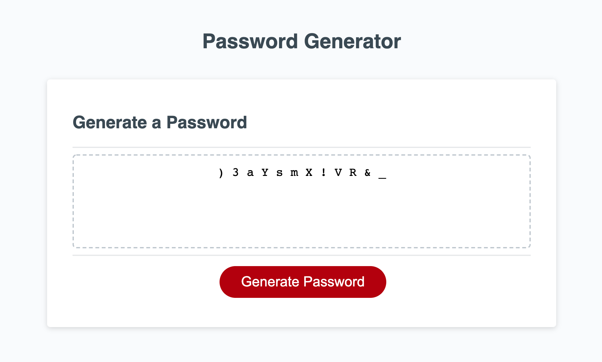

For this weeks homework, we were tasked to develop a password generator that was constructed from a number of variables that were confirmed by the user. To develop this, first I constructed my variables to hold all of the letters (both uppercase and lowercase), the special symbols, and numbers that will be included in the password once its generated. Form there I set my arrays at starting points. Now to the generateBtn, this is where all my prompts live for the site to gather the information we need to generate the password. 

I built in some protector code in case someone uses a value outside 8 and 128, that way the program doesn't tweak itself out. I then built the functions surrounding the user inputs and what it would do if its true. In this case, set those values to the selected arrays and then merged them all at the end. I also set a function called passReset to keep the first time the page loads at a 0 value. Finally comes the math portion of the work. I took the arrays and merded them into the userPassword empty array I had at the beginning so all those values live there, then I took them and made a function to shuffle those values in our final product to then show on the page! 

Heres an image of what it looks like when its completed! 

To find all my work, I've kept it all inside the Develop folder!

Finally, heres the link to find the page! 
[Password Generator](https://joecliffordofficial.github.io/password_generator_hw3/)